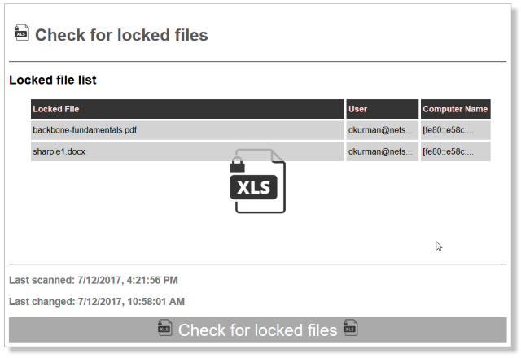

# README - File Server Locked File Watcher

## Who has that damn Excel file locked

Companies work from Excel, Word and other files on network shared folders.  More than one user cannot usually work on these files at the same time.  Time is lost tracking down who has the file locked.

It can be hard to see who has a file locked. Sometimes Excel or Word shows who.  But not always. Other file like shared PDF's and CAD file types do not help much.

One way to see who locked a file is from the Windows file server as Administrator. Not practical for security reasons.

This tool has two parts:

* A watcher that checks for locked files. The watcher uses a search list for _watched_ files and folders.
* A web server that displays the locked files and who locked them. No need for special access. Just check a web page.

**Demo** -- [https://p7th0n.github.io/check_for_locked_files/](https://p7th0n.github.io/check_for_locked_files/)

## Quick setup

* Clone or download and extract this repo to a folder on the file server.
* Make sure [NodeJS](https://nodejs.org/en/) and npm are installed and on the PATH.  Open a command line to the repo location and run **npm install** to initialize.
* From the same command line start the web server - **npm start**.  By default it runs on port 80 so if that is a problem edit _package.json_ _scripts/start_.  Visit [http://fileserver-name](http://fileserver-name/).
* In a separate command line start File lock watcher - **npm run watch** [requires _**Administrator**_ privledges]



### Configure Watch list

* Open _**wwwroot/assets/data/watchlist.json**_
* Add, remove or edit items in the watchList array.
* Save changes.
* The watcher reads _watchlist.json_ on each cycle so there's no need to restart the watcher script.

```json

{
    "watchList": [
        "README",
        "dave",
        "checkforlocks"
    ]
}

```

## Summary of set up

* File server watcher - this Powershell process requires administrator privledges on the Windows file server.
* Web server - the NodeJS simple http-server shows the web page. Microsoft IIS can also host the web page.  Be sure that IIS doesn't cache the content; especially _./assets/data/output.json_.
